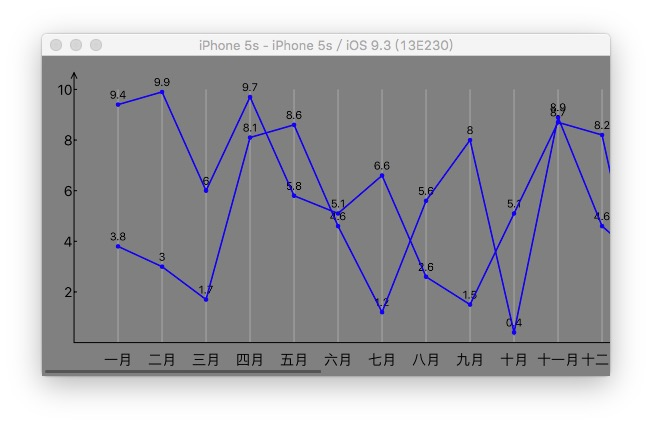
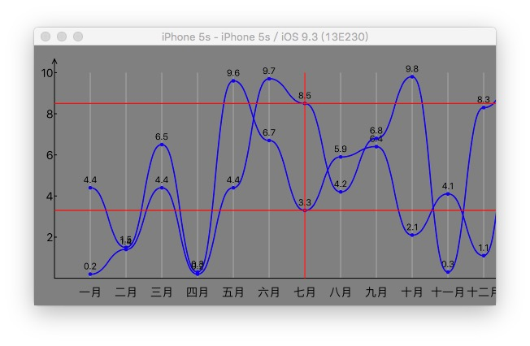

# ZCChartLineView-Chartline
### 一个具有丰富自定义的框架,简单易用,可画曲线/直线,支持滚动视图




````objc

/*
 *数轴设置
 */
@property (nonatomic,assign) BOOL showCoordinateArrowhead;//设置是否显示数轴箭头

/**
 *  颜色设置
 */
@property (nonatomic,strong,nonnull) NSArray<UIColor *> *lineColors;//设置线条颜色,如果颜色提供的不足,那么多余的线条自动使用最后一个颜色
@property (nonatomic,strong,nonnull) NSArray<UIColor *> *roundColors;//设置圆点的颜色,如果颜色提供的不足,那么多余的圆点自动使用最后一个颜色
@property (nonatomic,strong,nullable) UIColor *showAssistLineColor;//设置显示图表中的辅助横线的颜色

@property (nonatomic,strong,nonnull) UIColor *strokeColor;//设置绘制的线条颜色

/**
 *  线条绘制设置
 */
@property (nonatomic,strong,nonnull) NSArray <NSString *> *x_title;//设置 x 的轴的标签
@property (nonatomic,strong,nonnull) NSArray <NSArray *> *y_arrayValues;//设置 y 值,可以绘制多条线
@property (nonatomic,assign) CGFloat lineWith;//设置绘制的线宽度

/**
 *  字体设置
 */
@property (nonatomic,strong,nonnull) UIFont *xy_label_font;//设置 x ,y 标题font
@property (nonatomic,strong,nonnull) UIFont *valueLabel_font;//设置显示数值的标签字体

@property (nonatomic,assign) BOOL showValue;//设置是否显示图表中的数值

@property (nonatomic,assign) BOOL showVerticalLine;//设置是否显示图表中的辅助竖线


@property (nonatomic,assign) CGFloat showAssistLineWidth;//设置是否显示图表中的辅助横线的宽度

@property (nonatomic,assign) BOOL showAssistLine;//设置是否显示图表中的辅助竖线

@property (nonatomic,assign) ZCChartlineType lintype;//设置直线的类型(曲线/折线)

````

###示例代码
````objc
lineView = [[ZCChartlineView alloc]initWithFrame:CGRectMake(0, 0, self.view.frame.size.width,self.view.frame.size.height)];
    lineView.x_title = @[@"一月",@"二月",@"三月",@"四月",@"五月",@"六月",@"七月",@"八月",@"九月",@"十月",@"十一月",@"十二月",@"一月",@"二月",@"三月",@"四月",@"五月",@"六月",@"七月",@"八月",@"九月",@"十月",@"十一月",@"十二月"];
    NSMutableArray *array = [[NSMutableArray alloc]init];
    for (int j = 0; j < 2; j ++) {
        NSMutableArray *tmp = [NSMutableArray new];
        for (int i = 0 ; i < lineView.x_title.count; i ++) {
            [tmp addObject:@(arc4random_uniform(100)/10.0f)];
        }
        [array addObject:tmp];
    }
    
    lineView.y_arrayValues = array;
    
        //    lineView.lintype = ZCChartlineTypeCurve; //曲线绘制
    [lineView strokeLine];//画线

````
